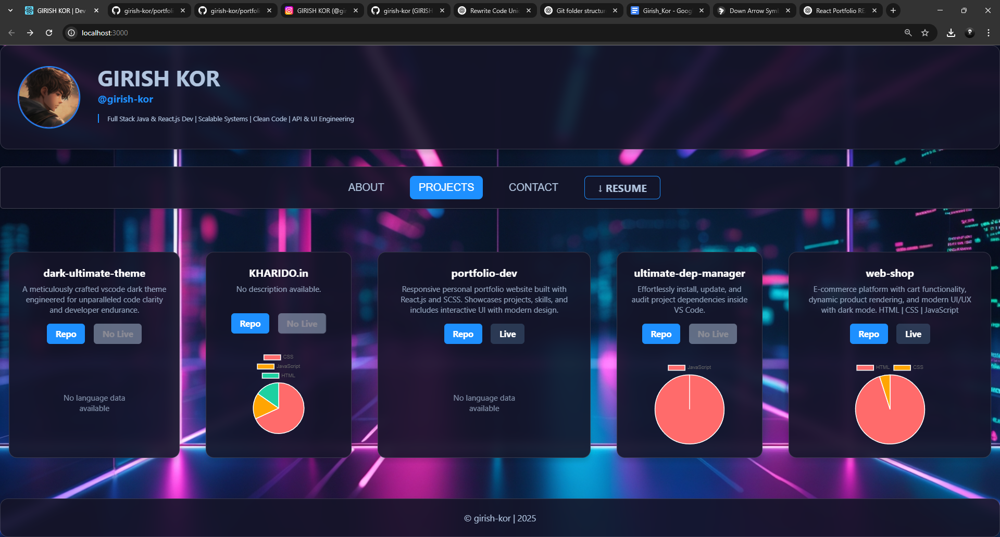

# React Portfolio



## 📌 Overview

A React-based portfolio showcasing skills, projects, and GitHub repositories dynamically.

🔗 **Live Demo:** [Portfolio Live](https://portfolio-dev-rb30.onrender.com/)

## 🚀 Features

- Fetches GitHub profile and repositories dynamically
- Displays tech skills, soft skills, and interests
- SCSS for styling
- Interactive navigation and smooth UI
- Responsive and optimized for all devices

## 🛠 Tech Stack

- **Frontend:** React, SCSS, Chart.js
- **Data Fetching:** Axios, GitHub API

## 📂 Project Structure

```
portfolio-dev-main/
├── public/
├── src/
│   ├── assets/
│   │   ├── preview.png
│   ├── components/
│   │   ├── ContentNav.jsx
│   │   ├── Footer.jsx
│   │   ├── Header.jsx
│   ├── pages/
│   │   ├── About.jsx
│   │   ├── Contact.jsx
│   │   ├── Projects.jsx
│   ├── main.scss
│   ├── App.jsx
│   ├── index.jsx
├── package.json
├── README.md
```

## 📦 Installation

```sh
git clone https://github.com/girish-kor/portfolio-dev.git
cd portfolio-dev
npm install
```

## 🚀 Usage

```sh
npm start
```

## 🔧 Scripts

- `npm start` – Runs the project in development mode.
- `npm run build` – Builds the project for production.
- `npm run lint` – Lints JavaScript files.
- `npm run format` – Formats code using Prettier.

## 📜 License

This project is licensed under the **ISC License**.

## 📬 Contact

For issues or feedback, open an issue at [GitHub Issues](https://github.com/giris-hkor/portfolio-dev/issues).
